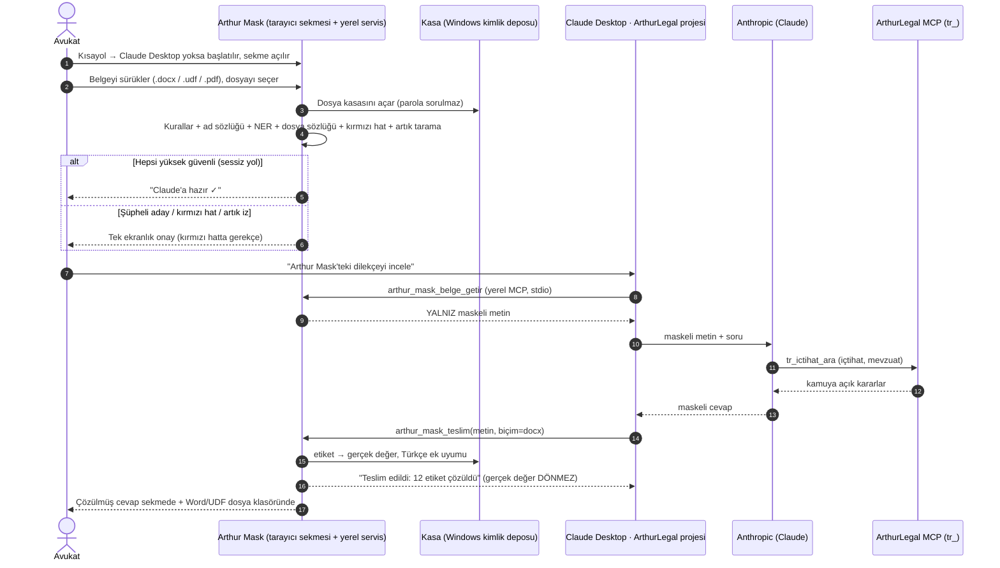

# Arthur Mask: masaüstü akışı ve Claude köprüsü

**Hedef:** Avukat Arthur Mask'i tek tıkla kurar. Kısayoldan açtığında tarayıcıda AL
kimliğinde bir sayfaya belgeyi sürükler. Belge cihazda maskelenir ve ArthurLegal'e
(Claude Desktop'taki proje, `tr_` bağlayıcısı) **yalnız maskeli hâliyle** gider. Cevap
maskeli döner, Arthur Mask'te gerçek adlarla Word/UDF olarak açılır. Kullanıcıya ek ücret
yoktur; ek adım en azdır.

Kararların tamamı ve kabul ölçütleri: [faz-1-sartname.md](faz-1-sartname.md).

## 1. Belirleyici kısıt

claude.ai'nin, dışarıdan bir sohbete belge gönderip cevabı geri alan resmî bir API'si
**yoktur**. Köprü bu yüzden iki parçadan oluşur:

| Parça | Görevi | Neden |
|---|---|---|
| **Claude Desktop + yerel MCP köprüsü** | Maskeli belgeyi Claude'a verir, Claude'un teslim ettiği cevabı yerelde çözer | Resmî uzantı noktası; mevcut abonelikle çalışır, API ücreti yok |
| **claude.ai web için salt çözücü eklenti** | Ekranda akan cevaptaki etiketleri yalnız bu cihazda gerçek değerle gösterir | Cevap akarken okunabilirlik; gönderime dokunmaz |

Eklenti gönderimi **yakalamaz**. claude.ai arayüzü değişince bozulan bir gönderim yakalayıcı
ham belgeyi fark edilmeden geçirebilir. Salt çözücü bozulursa kullanıcı yalnız etiket görür,
sızıntı olmaz.

## 2. Akış

Temel ilke: gerçek değer yerel süreçten hiçbir araç sonucuyla çıkmaz. Model yalnız etiketi
görür. Çözme, modelin **teslim ettiği** metin üzerinde yerelde yapılır.

### MCP araçları

| Araç | Döndürdüğü | Not |
|---|---|---|
| `arthur_mask_belgeler` | Hazır belgelerin listesi (kimlik, sayfa, etiket sayısı) | Dosya adları da gerçek ad içerebileceği için `belge-3` gibi kimlik kullanılır |
| `arthur_mask_belge_getir(kimlik, sayfa?)` | Maskeli metin + etiket türleri lejantı | Büyük belgede sayfalı |
| `arthur_mask_teslim(metin, bicim, baslik)` | "Kaydedildi, N etiket çözüldü, kasada olmayan: [...]" | Çözme, ek uyumu, DOCX/UDF yerelde |

Ham metni maskeleyen bir araç **bilerek yoktur**. Öyle bir araç olsaydı modelin ham metni
önce görmesi gerekirdi.

ArthurLegal proje talimatına eklenecek bölüm:

> Kullanıcı belge incelemesi istediğinde metni `arthur_mask_belge_getir` ile al.
> `{{KİŞİ-01}}` biçimindeki maske etiketlerini harfi harfine koru; ek getirirken kesme
> işareti kullan (`{{KİŞİ-01}}'in`). Etiketlerin gerçek değerini tahmin etmeye çalışma.
> İçtihat araştırma sorgularına etiket yazma. Nihai taslağı `arthur_mask_teslim` ile teslim et.

## 3. Yerel servisin yaşam döngüsü

- Servis, Claude Desktop MCP köprüsünü başlattığında açılır, Claude kapanınca kapanır.
  Tepsi simgesi yoktur.
- **Arthur Mask** kısayolu Claude Desktop çalışmıyorsa önce onu başlatır, servis ayağa
  kalkınca varsayılan tarayıcıda sekmeyi açar.
- Claude kapalıyken arayüz ve eklenti çözücüsü çalışmaz. Sekme bunu açıkça gösterir:
  "Arthur Mask bağlantısı yok — Claude Desktop'u açın".
- Servis yalnız `127.0.0.1`'e bağlanır. Kurulum başına rastgele belirteç kullanır ve
  Origin denetimi yapar; eklentiye yalnız kendi kimliğiyle izin verir.

## 4. Kurulum ve güncelleme

- Tek `ArthurMask-Kurulum.exe`: Python çalışma zamanı, bağımlılıklar ve NER modeli gömülüdür.
  Kurulum şunları yapar:
  - Başlat menüsüne ve masaüstüne kısayol koyar,
  - MCP köprüsünü Claude Desktop'a kaydeder,
  - `Belgeler\Arthur Mask\` klasörünü açar,
  - Chrome/Edge salt çözücü eklentisinin kurulum bağlantısını gösterir.
- Kasa anahtarı Windows Kimlik Bilgisi Yöneticisi'nde (DPAPI) durur, parola yoktur.
  Kurulumda bir kurtarma anahtarı üretilir. Kullanıcı bunu yazdırır ya da ortakta şifreli
  saklar.
- Sürümler herkese açık ArthurLegal deposunun sürüm sayfasından dağıtılır. Uygulama yeni sürümü bildirir, kullanıcı tek
  tıkla günceller. Sessiz otomatik güncelleme yoktur: tanıyıcı veya model değişince
  değerlendirme yeniden koşulmadan sürüm çıkmaz.

## 5. Güvenlik ayrıntıları

- Özgün belge kopyalanmaz, yerinde okunur. Maskeli ara kopyalar dosya klasöründe 30 gün
  kalır, sonra silinir. Çözülmüş çıktılar ve kasa kalır.
- Ham dosyanın sohbete sürüklenmesi teknik olarak engellenemez; bu eğitim ve arayüz uyarısıyla
  karşılanır. Arayüz kullanıcıya yalnız `*.maskeli.*` kopyalarını gösterir.
- Yerel kayıt yalnız kırmızı hat onaylarını tutar: tarih, kullanıcı, belge özeti (hash),
  kategori, gerekçe. Gerçek değer kaydedilmez.
- Word görselleri (imza, kimlik fotokopisi) maskelenmez. Köprü Claude'a yalnız metin verir,
  görseller Claude'a gitmez.

## 6. Hukuki sınırlar (yumuşatılamaz)

- Takma adlandırma anonimleştirme değildir. Kasa büroda olduğu için veri kişisel veri
  olmaya devam eder. **KVKK m.9** aktarım değerlendirmesi ve **Av.K. m.36** sır saklama
  analizi ayrıca yapılır. Claude hesabında veri saklama ve eğitim ayarları teyit edilir.
- Maskeleme kimliği gizler, içeriği gizlemez. Kırmızı hat başlıkları maskeli olsa da gitmez.
- Tespit olasılıksaldır. Gerçek büro belgelerinden türetilmiş TR değerlendirme seti
  kurulmadan "tam koruma" iddiası kurulmaz.
